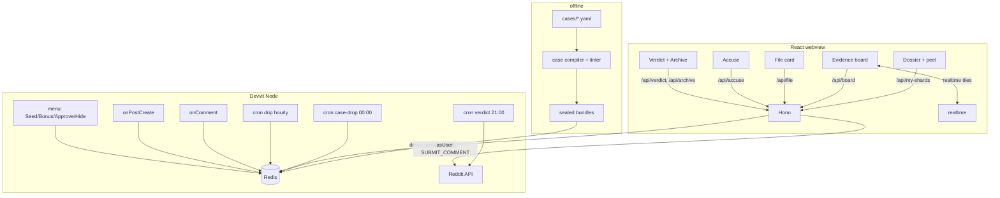

# ARCHITECTURE — REDACTED

## Stack

| Layer | Choice | Why |
|---|---|---|
| Client | React, DOM/CSS only (paper/typewriter) | Zero canvas/physics risk; maximum polish-per-hour; flawless mobile |
| Server | Devvit serverless Node + Hono | `/api/*` + `/internal/*` |
| State | Devvit Redis (sealed truth + zsets + tx) | Truth split from public docs at compile time |
| Jobs | Scheduler ×3 (drop / drip / verdict) | The drip valve and ceremony are cron-native |
| Authoring | Offline TS case compiler + linter | Content quality is a build-time guarantee, not a runtime hope |
| Boilerplate | `devvit-template-react` (official) | No boilerplates.json match for Devvit |

No ML/LLM anywhere — cases are handcrafted; in an anti-AI-slop hackathon this is stated as a feature.

## System diagram

## Redis schema

| Key | Type | Content |
|---|---|---|
| `live:caseId` | string | id of the currently-live case |
| `case:{id}:public` | hash | documents, suspects, shardMeta (no text of undealt shards' truth flags) |
| `case:{id}:truth` | hash | ground truth + elimination graph — **server-only, never serialized** |
| `case:{id}:contradictions` | hash | annotated contradiction pairs |
| `case:{id}:shardText` | hash | shardId → shard text |
| `case:{id}:shardOrder` | zset | shard authoring order |
| `case:{id}:meta` | hash | case-level metadata (title, launch day, etc.) |
| `pivot:{id}` | zset | reserved pivot shardIds (drain order) |
| `board:{id}` | zset | filed cardIds by ts |
| `card:{id}` | hash | one filed evidence card's content + author |
| `deal:{id}` | hash | userId → this viewer's dealt shard set (deterministic, pivot-aware) |
| `accuse:{id}` | hash | userId → {suspect, stake, ts} (tx-written) |
| `accuseTally:{id}` | hash | per-suspect accusation counts |
| `drip:{id}:guards` | hash | idempotency guards for the hourly drip job |
| `verdict:{id}` | hash | settled verdict result (culprit, earliest correct accusers) |
| `postToCase` | hash | postId → caseId (bound by cron + onPostCreate trigger) |
| `closed:cases` | zset | archive index of settled cases |
| `forge:queue` | zset | community case bundles pending mod approval |
| `reports:{id}` | hash | mod-hide/report actions on filed cards |
| `rep:cited` / `rank:season` | zset | citation economy + flair ladder |

## API endpoints

| Route | Method | Purpose |
|---|---|---|
| `/api/case` | GET | public case docs + meter + board summary |
| `/api/my-shards` | GET | deterministic deal for this user (pivot-aware) |
| `/api/file` | POST | file card (asUser comment or app fallback) + board write |
| `/api/board` | GET | filed cards + contradiction state |
| `/api/accuse` | POST | accusation escrow (tx) |
| `/api/verdict` | GET | settled verdict + earliest-correct-accusers for a closed case |
| `/api/archive` | GET | closed-case replay timelines |
| `/internal/cron/drop` | POST | daily case drop (idempotent) |
| `/internal/cron/drip` | POST | hourly highest-information shard release |
| `/internal/cron/verdict` | POST | scheduled verdict ceremony (idempotent) |
| `/internal/triggers/post-create` | POST | bind day-state to the scheduler-created post |
| `/internal/triggers/on-comment` | POST | thread↔board reconciliation |
| `/internal/menu/seed-demo` `/bonus-case` `/approve-forge` `/hide-card` | POST | Seed Demo Case · Launch Bonus Case · Approve Forge · Hide Card |

## Invariants & residual risk

I1–I4 in COMPLEXITY.md (deal determinism, truth non-serialization, pivot drain, single accusation). **Residual:** off-platform shard sharing (screenshots in Discord) can't be prevented — reframed in README: sharing is *playing* (the board just formalizes it); onComment payload shape confirmed at runtime before the parser is written (trigger verified in docs-cache/triggers.md); verdict cron missing → retry + Bonus-Case menu path, ceremony idempotent. **API verification CLOSED 2026-07-04:** flair + comment sticky + submitComment all confirmed in `@devvit/reddit@0.13.6` .d.ts (docs-cache/VERIFIED.md).
