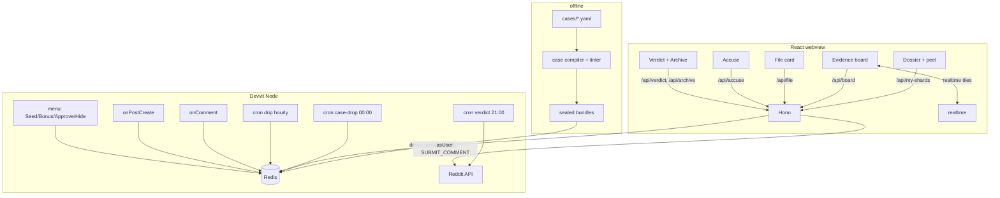

<div align="center">
  
  <h1>REDACTED</h1>
  <p><em>not trivia — closed-world deduction; zero AI, handcrafted linted cases</em></p>
  

  <br/><br/>

  [](https://www.reddit.com/r/the_redacted_game_dev/)
  [](https://www.youtube.com/watch?v=nWXwBE4XXTs)
  [](https://devpost.com/software/redacted-0jze1y)
  [](https://edycutjong.github.io/redacted-game/)
  [](https://edycutjong.github.io/redacted-game/pitch/)
  [](https://redditgameswithahook.devpost.com)

  <br/>

  
  
  
  
  
  [](https://github.com/edycutjong/redacted-game/actions/workflows/ci.yml)
</div>

A daily noir detective case lives inside a Reddit post. Every player's dossier is
**censored differently**: a deterministic deal hands each viewer a few unredacted
lines out of ~40 clue shards that the crowd doesn't have yet. Nobody can solve the
case alone — the comment thread becomes the evidence board where the subreddit
collectively un-redacts the truth, flags contradictions, and votes an accusation
before the verdict ceremony. A judge who opens the post isn't evaluating a game;
within 30 seconds they're personally holding a line 400 strangers need.

It is **not trivia** (closed-world deduction over fictional evidence — no outside
knowledge helps) and **not collaborative storytelling** (one authored ground
truth, a win/lose verdict). There is **zero runtime AI**: all 3 launch cases are
handcrafted and pass an offline solvability linter. In an anti-AI-slop hackathon,
that is the whole point, stated out loud.

## 🎮 How to play

1. **RECEIVE** — open the case folder (`CASE #17 · DAY 3 · 61% UNREDACTED`). One
   black bar is *yours*: tap it and the redaction peels off to reveal your line
   ("the pawn ticket was dated the 14th — two days AFTER the fire").
2. **READ THE BOARD** — evidence cards other players filed; contradiction pairs
   glow red where both sides are on the board (the red string is *computed*, not
   moderated).
3. **FILE** — one tap posts your line as a typeset evidence-card comment, under
   your username if you consent (asUser `SUBMIT_COMMENT`) or via the app account
   otherwise. The case meter ticks up; the ACCUSE bars shift.
4. **ACCUSE / RETURN** — stake season points on one suspect (locked in a single
   transaction, one accusation per case). At the scheduled hour the verdict
   ceremony crowns the earliest correct accusers and cites the cards that cracked
   it; a new case drops at 00:00.

**The population-elasticity valve:** after case-hour 12 a scheduler drips the
single highest-information unfiled shard onto the public board every hour, so even
a 30-member sub closes every case and a judge arriving mid-case always lands in a
live investigation. A solo **Cold Case Archive** replays closed cases against the
recorded solve timeline — no liveness dependency for judges.

**The witnessable "I am needed" beat (seeded Case #17).** The demo seed leaves the
crowd-favorite watchman *standing* at exactly **61%** — the crowd has already
cleared the widow and the rival, and the whole board is stuck arguing about him.
Filing your reserved pivot shard (the pawn ticket) ticks the meter **61 → 63%**,
**strikes the watchman**, and lights the second red string — in one tap. That beat
is deterministic (`core/demoSeed.ts`), proven at build time (lint **LD**), and
locked by tests, so a lone cold judge witnesses their own impact.

## 🏗️ Architecture (verified Devvit surface only)

```
src/client/     React, DOM/CSS only — paper folder, typewriter type, redaction-peel
src/server/     Hono over the Devvit runtime
  core/         PURE engine: hash, dealer, deduction, drip, verdict, meter,
                contradictions, filters, cardMarker, time, demoSeed  (no platform imports)
  store.ts      the ONLY Redis-touching layer (hashes + zsets + watch/multi/exec)
  serialize.ts  the I2 boundary — builds client responses, never touches truth
  routes/       thin adapters: /api/*, /internal/{cron,triggers,menu}/*
tools/case-compiler/   offline YAML → sealed bundle + solvability linter
cases/*.yaml    the authored cases (compiled to cases/compiled/*.bundle.json)
```



Full Redis schema (`case:{id}:public` vs **`case:{id}:truth`**, `shards`/`board`/`card`
hashes, `pivot`/`board`/`accuse`/`rank:season`/`rep:cited` zsets) and endpoint tables are in
[`ARCHITECTURE.md`](ARCHITECTURE.md). **No plain redis lists/sets, empty
fetch allowlist, no runtime AI** — enforced by design.

### Four invariants

| # | Invariant | Where it lives |
|---|-----------|----------------|
| I1 | Deal is pure + deterministic — same viewer always sees the same lines | `core/dealer.ts` + first-write-wins persistence in `store.dealFor` |
| I2 | No endpoint returns undealt shard text or any truth field | truth split at **compile time**; `serialize.ts` is the only response builder |
| I3 | Pivot pool drains before duplication — every fresh viewer (every judge) gets a board-absent shard while pivots remain | `pivot:{id}` zset drained head-first in `store.dealFor` |
| I4 | One accusation per (user, case), stake locked | `store.accuse` under `watch/multi/exec` |

## 🗂️ Case format

A case is one YAML file (schema: `tools/case-compiler/types.ts`, guide:
[`cases/README.md`](cases/README.md)). In brief:

- `suspects` (≥3), `docs` (≥2) whose `lines` are either `text:` or a `shard:` ref,
  `shards` (≥20) each `{id, doc, text, supports:[factIds]}`,
- `facts` (≥4) — atomic truths, each established by ANY one of its supporting
  shards being on the board,
- `eliminations` — per non-culprit suspect, ≥2 paths (a path is a conjunction of
  factIds; any complete path strikes the suspect),
- `contradictions` (≥2) annotated shard pairs, `pivots` (≥1) reserved for
  first-seen accounts, and a `truth` block (`culprit`, `motive`, `summary`,
  `reveal[]`). The culprit has **no** elimination entry — they can never be struck.

The compiler splits the sealed bundle into a **public half** (`src/shared`) and a
**server-only truth half** (`src/server/cases/types.ts`) so truth cannot be
serialized to a client by construction.

## 🧩 Solvability linter (the moat)

`npm run lint:cases` runs three levels over every case (`tools/case-compiler/lint.ts`):

- **L1 solvability** — the culprit is uneliminable; every other suspect is
  eliminable by ≥2 **shard-disjoint** combinations; and a seeded **Monte-Carlo of
  1,000 random 60% deals all reach the truth** (all non-culprits struck). The MC
  uses the *same* deduction engine as the runtime, so gameplay and lint can never
  diverge.
- **L2 drama** — ≥2 annotated contradiction pairs; no orphan shards (every shard
  participates in some elimination path).
- **L3 safety** — profanity / link / real-user-resemblance (`u/`, `r/`) filter over
  all case text; sealed bundle ≤ 200KB.
- **LD demo** — when a case names a demo `reserve:` suspect, *prove the magic
  moment*: on the planned ~61% seed the reserved crowd-favorite is still standing,
  and filing a reserved pivot shard strikes them. The "I am needed" beat is a
  build guarantee, not a hope — same deduction engine as L1.

Current status (`npm run lint:cases`):

```
✓ case-017 "The Larchmont Fire" — 49 shards, 4 suspects, MC 1000/1000, bundle 16.3KB
✓ case-018 "The Halloway Vault" — 40 shards, 4 suspects, MC 1000/1000, bundle 13.3KB
✓ case-019 "The Gilt Cage"      — 40 shards, 4 suspects, MC 1000/1000, bundle 13.7KB
```

## ✅ Tests

**269 vitest tests across 17 files** (`npm test`), all green, against the pure
cores + an in-memory Redis stub that implements the real `RedisClient` surface
(including `watch/multi/exec` optimistic concurrency) and Hono routes with
`@devvit/web/server` mocked out end-to-end:

| file | n | covers |
|---|---|---|
| store.test.ts | 37 | deal determinism (I1), pivot drain (I3), accusation escrow under contention (I4), seed determinism, **reserve-aware seed + witnessable strike**, file/drip/verdict idempotency, degenerate/partial-data edge cases |
| routes/api.test.ts | 37 | all `/api/*` endpoints end-to-end (case/my-shards/file/board/accuse/verdict/archive), consent-gated comment fallback, litContradiction + elimination deltas, best-effort realtime |
| routes/internal.test.ts | 32 | scheduler crons (drop/drip/verdict), the onComment trigger reconciliation, mod-menu actions, idempotency + best-effort Reddit side-effects |
| linter.test.ts | 28 | Monte-Carlo per case, disjointness, L2/L3, **LD demo magic-moment** proof, negative mutations |
| drip.test.ts | 28 | information-gain ordering, hour-12 gate, **10/100/1000-player closure sims** |
| deduction.test.ts | 15 | fact/path/elimination/truth-reached per authored case |
| hash.test.ts | 14 | fnv1a / mulberry32 / pickK determinism, bar width id-derived |
| verdict.test.ts | 13 | idempotent resolve, podium payouts, citation rules, public-record earns no citation |
| filters-marker.test.ts | 12 | L3 filters, note sanitizer, comment-marker round-trip |
| serialize.test.ts | 11 | **I2 — truth never serialized**, censored bars carry no text |
| dealer.test.ts | 10 | deterministic deal + pivot reservation |
| meter-time.test.ts | 8 | meter clamping, case-day / verdict clock |
| contradictions.test.ts | 6 | lit / newly-lit deltas |
| postComment.test.ts | 6 | consent-gated comment posting + app-account fallback chain |
| shared.test.ts | 5 | realtime channel naming, rank tiers, redis key schema |
| viewer.test.ts | 4 | logged-out → loid → anon fallback chain |
| demoSeed.test.ts | 3 | synthetic-bundle branches the 3 authored cases never happen to hit |

`npm run type-check` (`tsc --noEmit`) is clean; `npm run build` emits
`dist/client/{splash,game}.html` + `dist/server/index.cjs`.

### Coverage

`npm run test:coverage` enforces a **100% statements/branches/functions/lines**
gate (vitest.config.ts), scoped to the pure/mockable business logic —
`src/shared/**`, `src/server/core/**`, `src/server/cases/**`,
`src/server/routes/**`, and the single Redis-touching `store.ts` +
`serialize.ts` + `keys.ts` + `viewer.ts` + `postComment.ts` + `redisLike.ts`.
Excluded on purpose: `src/client/**` (React/DOM rendering — needs a real
browser) and `src/server/index.ts` (process bootstrap — calls
`createServer(...).listen(...)` at import time). 15 lines carry a narrow
`/* v8 ignore */` with a one-line rationale, all for data-integrity guards
that are unreachable given the compiler's own validation (e.g. every
elimination-path fact id is checked against the case's fact set at compile
time) or a fixed, non-empty generated registry — never a shortcut around a
real test.

## ⚙️ Engineering harness

| Layer | Tool | Where |
|---|---|---|
| Type safety | `tsc --noEmit` (strict) | CI · `npm run type-check` |
| Lint | ESLint 9 + typescript-eslint (flat config) | CI · `npm run lint` |
| Unit tests + coverage | Vitest — 269 tests / 17 files, 100% on the pure/mockable core (real-surface Redis stub) | CI · `npm run test:coverage` |
| Content quality | Solvability + demo linter (MC 1000/1000) | CI · `npm run lint:cases` |
| Build | Vite → `dist/client` + `dist/server` | CI · `npm run build` |
| SAST | CodeQL (`javascript-typescript`) | `.github/workflows/codeql.yml` |
| Supply chain | Dependabot (npm + actions, weekly) | `.github/dependabot.yml` |

`.github/workflows/ci.yml` runs the five real gates on **Node 20**:
`npm ci → lint → type-check → test:coverage → lint:cases → build`.

**Deliberately N/A — Lighthouse CI and Playwright-against-localhost.** This is a
Devvit Web app: the client is bundled into `dist/client/*.html` and served by the
Reddit runtime inside a webview, so there is no localhost server to point a
headless browser or Lighthouse at. Interactive verification is `devvit playtest`
(human-run — see the First-playtest checklist below).

## ⚠️ Honest limitation: off-platform sharing

Deterministic per-viewer censorship means a determined group **can** screenshot
their shards into a Discord and pool them off-platform. We do **not** claim to
prevent this, and it isn't a leak of the ground truth (the truth section never
leaves the server — I2): a screenshot only reveals shards those accounts were
already dealt. In practice that behaviour *is* the game — the evidence board just
formalizes and rewards (citation economy) the un-redaction the crowd would do
anyway. The design leans into sharing rather than pretending to stop it.

## 📋 First playtest checklist (do this in order)

You (the human) run these — an agent cannot run `devvit playtest`.

1. **Create the test subreddit from your aged main account on day one.** New
   hackathon subreddits are being **auto-banned ("Rule #2")** by Reddit safety
   automation, *including a re-ban immediately after you install a Devvit app*.
   Front-load the round-trip: create r/the_redacted_game_dev, add a normal pinned post
   *before* installing anything, and keep the unban-request forum thread handy —
   staff unban manually when you post `username + subreddit`. Expect a second
   ban at first app install.
2. `npm run login` (`devvit login`), then `npm run dev` (`devvit playtest
   r/the_redacted_game_dev`).
3. **Probe the onComment payload before trusting the parser.** The
   `onCommentCreate` trigger exists (docs-cache `triggers.md`) but the exact
   `CommentV2` field shape is only confirmed at runtime. The handler
   (`src/server/routes/internal.ts`) is a **defensive adapter** that reads every
   field optionally and no-ops on anything unrecognised — file one card, watch the
   logged payload, confirm `comment.body` / `comment.author`, then tighten.
4. From the mod menu run **REDACTED: Seed Demo Case** → restores Case #17 at ~61%
   with the pivot pool full and the first contradiction lit (idempotent). Open the
   post, peel your shard, file it, watch the meter tick and a suspect bar shift.
5. Verify the three crons (`/internal/cron/{drop,drip,verdict}`) — all idempotent —
   and, if you want extra live cases during judging, **REDACTED: Launch Bonus Case**.
6. `npm run check:submission` to re-run the readiness gate before you record video.

## 📮 Submission checklist

Run `npm run check:submission` before submitting. The demo-post URL stays a
placeholder (and the gate stays red) until the post is live.

> **The remaining `[ ]` items need no app approval — do them now.** The Reddit
> review only unlocks the *public* App Directory listing + icon; judging happens on
> your (public) test sub, which is entirely in your control.

- App listing: https://developers.reddit.com/apps/the-redacted-game
- Devpost project: https://devpost.com/software/redacted-0jze1y
- Demo video: https://www.youtube.com/watch?v=nWXwBE4XXTs
- Demo post: https://www.reddit.com/r/the_redacted_game_dev/s/f04ylDXAJr
- [x] `npm run lint` clean
- [x] `npm run type-check` clean
- [x] `npm test` green (269/269), `npm run test:coverage` at 100%
- [x] `npm run build` succeeds
- [x] Published to the App Directory (`devvit publish`, in review)
- [x] 60-second demo video recorded & published (link above)
- [x] Public repo + Devpost project page linked
- [x] `r/the_redacted_game_dev` set to **Public**, demo post seeded (`Seed Demo Case`) and verified against `DEMO.md`
- [ ] Demo-post URL filled above + Devpost form submitted

## 💻 Commands

```
npm run lint           # eslint .
npm run type-check     # tsc --noEmit
npm test               # vitest run  (269 tests)
npm run test:coverage  # vitest run --coverage  (100% on shared/core/routes/store)
npm run lint:cases     # solvability linter over cases/*.yaml
npm run compile:cases  # emit cases/compiled/*.bundle.json + src/server/cases/registry.ts
npm run build          # vite build → dist/client + dist/server
npm run dev            # devvit playtest  (you run this)
npm run check:submission
```

## 🔖 Versioning

Automatic semantic versioning via [semantic-release](https://semantic-release.gitbook.io/):
every push to `main` parses [Conventional Commits](https://www.conventionalcommits.org/)
(`fix:` → patch, `feat:` → minor, `BREAKING CHANGE:` → major) and, when warranted,
bumps `package.json`, updates `CHANGELOG.md`, tags the commit, and publishes a
GitHub Release with generated notes (`.github/workflows/release.yml`). No manual
version bumps, no npm registry publish (private app).

## 📄 License

[MIT](LICENSE) © 2026 Edy Cu. Built for Reddit's *Games with a Hook* hackathon.
